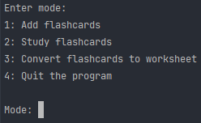
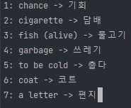
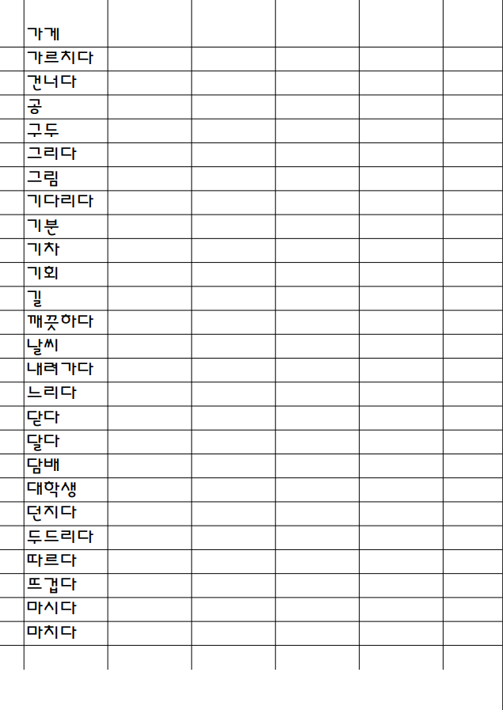

# Korean Flashcards

Run `python3 main.py` to begin studying Korean!

## Practice Vocabulary

Learn Korean words and phrases using flashcard sets.
Create your own flashcard sets with any words and expand your vocabulary with a variety of testing modes.

## Practice Writing

Inspired by Chinese character worksheets, practice written Korean by generating a printable worksheet from a flashcard set.
Worksheets are simple and full of space so that you can focus on the Korean by studying how you want to.

### Note

Korean Flashcards uses UTF-8.
Korean characters may not display properly in your terminal based on its configuration. [This link](https://stackoverflow.com/questions/388490/how-to-use-unicode-characters-in-windows-command-line) and [other resources](https://stackoverflow.com/questions/12649896/why-doesnt-my-terminal-output-unicode-characters-properly) can be used to properly display Korean characters in your terminal.
